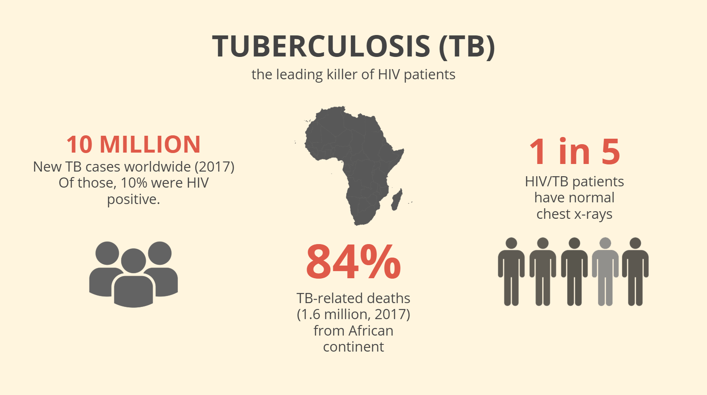

# MLEADS
## Machine Learing Early Detection System
-------------------------------------------------------------------------------------------------------------------------------------------

This project is maintained by the [2019 APOC Team](https://apoc.seas.upenn.edu)

**Appropriate Point of Care Diagnostics,** Class of 2019.

-------------------------------------------------------------------------------------------------------------------------------------------

**Program Aim:** To design self-contained portable, portable medical diagnostics to provide high quality medical care in resource limited settings.  

**Program Structure:** 5 months research and study on TB in Ghana. Project proposal. 3 weeks clinic and hospital visits in Ghana. 

**Project aim:** To reduce the number of early stage TB patients missed by the current triage system implemented in government health facilities in Ghana.

## PROJECT OVERVIEW

**PROBLEM BACKGROUND**

> 	Tuberculosis is a bacterial infection that primarily affects the lungs and has potential peripheral effects in other organ systems. Symptoms of tuberculosis include coughing, loss of weight and appetite, fever, chills, night sweats, and loss of proper function in any of the affected organs, including lymph nodes, bones, kidneys, brain, spine, and skin[(Source)](https://www.lung.org/lung-health- and-diseases/lung-disease-lookup/tuberculosis/). The tuberculosis bacteria tend to settle in the lungs and multiply to attack the respiratory system. In other cases, the bacteria can spread throughout the body via the blood and lymphatic system. Bacteria are extremely resilient and can be transmitted through the air by coughing or sharing eating areas. In a patient with a healthy immune system, the bacteria will be surrounded in mucous and engulfed in cells which attempt to fight it off, which block the alveoli. However, tuberculosis tends to be an opportunistic disease, targeting those with compromised immune systems, which leads to a high prevalence in people with HIV. Tuberculosis is currently the leading cause of death in HIV patients, with 32% of AIDS deaths in 2017 resulting from TB.

>	  Worldwide, tuberculosis is one of the top 10 causes of death, with approximately 10 million new cases and 1.6 million deaths in 2017 alone. Africa accounts for 84% of those deaths [(Source)](https://www.who.int/news-room/fact-sheets/detail/tuberculosis). In most hospitals, especially those in Ghana’s Ashanti region, the current system implemented  only refers patients who are showing symptoms of TB for TB tests which are mainly smear microscopy and GeneXPert tests.  However, with the introduction of the GeneXpert in Ghana, it has now become possible for the early detection of tuberculosis before the symptomatic stage is reached. This is because for tuberculosis testing, unless the patient is showing symptoms, TB testing is not done. However, we know that tuberculosis infected patients only start to show symptoms such as cough within the second or third month, though they are infectious by the second month.

Above is a graphic depicting the timeline for the progression of Tuberculosis.

>   As patients can visit the clinic as scarcely as every 3-6 months, symptom-based screening for tuberculosis is not the most effective solution to early TB detection, as it disregards most early cases of TB in which symptoms have not yet surfaced. For example, if a patient comes to the clinic in the second month of disease progression, they currently will not be tested for TB, and the next routine appointment would fall in month 5 of disease progression, where the patient grows too sick to work.

Our project proposes to identify more asymptomatic tuberculosis cases currently missed with machine learning in order to increase the effort to further eradicate the disease from Ghana.

**PROPOSED SOLUTION**

