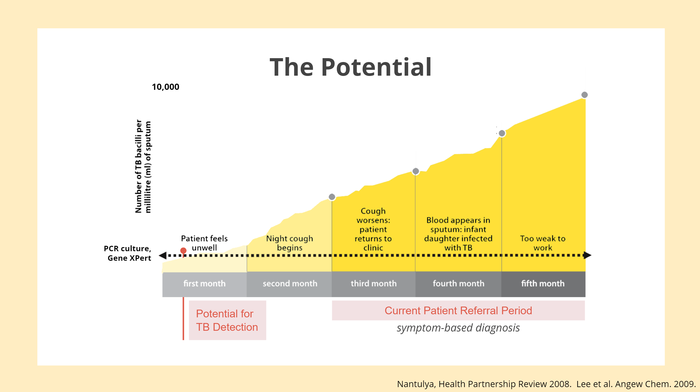

# MLEADS
## Machine Learing Early Detection System
-------------------------------------------------------------------------------------------------------------------------------------------

This project is maintained by the [2019 APOC Team](https://apoc.seas.upenn.edu)

**Appropriate Point of Care Diagnostics,** Class of 2019.

-------------------------------------------------------------------------------------------------------------------------------------------

**Program Aim:** To design self-contained, portable, medical diagnostics to provide high quality medical care in resource limited settings.  

**Program Structure:** 5 months research and study on TB in Ghana. Project proposal. 3 weeks clinic and hospital visits in Ghana. 

**Project aim:** To reduce the number of early stage TB patients missed by the current triage system implemented in government health facilities in Ghana.

## PROJECT OVERVIEW

**PROBLEM BACKGROUND**

Tuberculosis is a bacterial infection that primarily affects the lungs and has potential peripheral effects in other organ systems. Symptoms of tuberculosis include coughing, loss of weight and appetite, fever, chills, night sweats, and loss of proper function in any of the affected organs, including lymph nodes, bones, kidneys, brain, spine, and skin. [Source](https://www.lung.org/lung-health-and-diseases/lung-disease-lookup/tuberculosis/) The tuberculosis bacteria tend to settle in the lungs and multiply to attack the respiratory system. In other cases, the bacteria can spread throughout the body via the blood and lymphatic system. Bacteria are extremely resilient and can be transmitted through the air by coughing or sharing eating areas. In a patient with a healthy immune system, the bacteria will be surrounded in mucous and engulfed in cells which attempt to fight it off, which block the alveoli. However, tuberculosis tends to be an opportunistic disease, targeting those with compromised immune systems, which leads to a high prevalence in people with HIV. Tuberculosis is currently the leading cause of death in HIV patients, with 32% of AIDS deaths in 2017 resulting from TB.

Worldwide, tuberculosis is one of the top 10 causes of death, with approximately 10 million new cases and 1.6 million deaths in 2017 alone. Africa accounts for 84% of those deaths. [Source](https://www.who.int/news-room/fact-sheets/detail/tuberculosis) In most hospitals, especially those in Ghana’s Ashanti region, the current system implemented  only refers patients who are showing symptoms of TB for TB tests which are mainly smear microscopy and GeneXPert tests.  However, with the introduction of the GeneXpert in Ghana, it has now become possible for the early detection of tuberculosis before the symptomatic stage is reached. This is because for tuberculosis testing, unless the patient is showing symptoms, TB testing is not done. However, we know that tuberculosis infected patients only start to show symptoms such as cough within the second or third month, though they are infectious by the second month.

>Above is a graphic depicting the timeline for the progression of Tuberculosis.

   As patients can visit the clinic as scarcely as every 3-6 months, symptom-based screening for tuberculosis is not the most effective solution to early TB detection, as it disregards most early cases of TB in which symptoms have not yet surfaced. For example, if a patient comes to the clinic in the second month of disease progression, they currently will not be tested for TB, and the next routine appointment would fall in month 5 of disease progression, where the patient grows too sick to work.

**PROPOSED SOLUTION**

Our project proposes to identify more asymptomatic tuberculosis cases currently missed with machine learning in order to increase the effort to further eradicate the disease from Ghana. We propose to train nurses in clinics to operate a tablet-based app, which allows them to enter patient data in accordance with a variety of screening questions. The data from the app, once submitted, communicates with a computer program in python. The program will then pass the data through a machine learning algorithm of our design which will be trained by an existing dataset containing patient data and diagnoses. The algorithm, once trained, will be able to take in new survey inputs and output a likelihood in which the patient has TB, which can then aid the doctor’s decision regarding whether or not to refer the patient to a laboratory or a TB clinic for further examination.

**Why Machine Learning?** Machine learning, a subset of artificial intelligence, is the scientific study of algorithms and statistical models that computer systems use in order to perform a specific task effectively without using explicit instructions, relying on patterns and inference instead. [Source](https://en.wikipedia.org/w/index.php?title=Machine_learning&oldid=899398955) It provides a method for which patterns and correlations between large datasets can be studied where analysis would be too complicated for humans to interpret otherwise. Machine learning systems are constantly learning from their datasets and, as such, are able to update their output results over time. The constant retraining of data enables time trends to be studied and ensures that the algorithms remain applicable to such a dynamic dataset.

----------------------------------------------------------------------------------------------------------------------------------------

## PROJECT WALKTHROUGH

In java, the team created an app with the user interface for inputting patient data. The app features a language selection page, followed by a login page. For demonstrative purposes, the app interface is shown in English. In a future implementation of the project, it would also feature Twi and any other language specific to the area in which the project is to be implemented. The language selection page is featured below.

The app is only intended for nurses and trained professionals to use. As such, to protect the integrity of the dataset and security of patient information, we added a login feature before opening the app. Ideally, each nurse will be given their own username and password which will be added to a text file which the java program reads. The login page graphic and corresponding backend code are displayed below.

> In the implementation of the project, the login feature would be converted to a more secure API. The backend code and login feature were created and integrated in the GUI for demonstrative purposes.

**Login graphic**

-insert login graphic

**Login backend code:**

 	import java.io.*;
 	import java.util.*;

 	public class LoginBackend {

	 public final String filename;
	 private boolean valid;
	 private HashMap<String, String> users;
	
	 public LoginBackend(String name) throws IOException {
	 	filename = name;
		 valid = false;
		 users = new HashMap<String, String>();
		 try {
		 	String line = "";
		 	String user = "";
		 	String pass = "";
		 	BufferedReader reader = new BufferedReader(new FileReader(new File(filename)));
			
	 		line = reader.readLine();

	 		while (line != null) {	
	 			Scanner sc = new Scanner(line).useDelimiter(",");
		 		user = sc.next();
		 		pass = sc.next();
	 			users.put(user, pass);
	 			sc.close();
	 			line = reader.readLine();
	 		}
			
	 		reader.close();
	 	} catch (FileNotFoundException e) {
	 		System.out.println("File not found");
	 	}
 	}
	
 	public boolean login (String user, String pass) {
	 	if (users.containsKey(user) && users.get(user).equals(pass)) {
	 		valid = true;
	 	}
	 	return valid;
 	}
	}

Once the nurse has successfully logged in, the app then progresses to the main survey. The survey contains interactive buttons and text fields for nurses and medical professionals to input as they meet with the patient. Our current survey includes questions revolving around heart disease, as we used a [dataset](https://www.kaggle.com/ronitf/heart-disease-uci) for heart disease as a proof of concept for the project. Once implemented, the survey would include approximately 10 questions revolving around tuberculosis, measuring a variety of attributes such as prior exposure, potential risk factors, symptoms, and other patient data.

- Insert main survey graphic here

When the nurse clicks the submit button, the java program parses through each question and ensures a valid answer is entered. If the program finds an option is not chosen for a multiple choice question or a text box has an inadequate or non-number input, it will display an error message and will not progress until all entries are valid. Once the inputs are verified, the program writes the data to a text file and subsquently runs a python program designed by the team to process the data with the machine learning algorithm. The python program reads the text file and runs the data through the algorithm. Once results are gathered, the python program writes the results in a second text file. As the python program finishes, the java program continues, reading from the new text file with the output and displaying the result in a pop up message to the app user.

**Python algorithm:**

	def main():
	database_file="C:/githubProjects/APOC-2019/heart_ML_data.csv"
	input_file="C:/githubProjects/APOC-2019/APOCFinalGUI/entry.txt"
	#loading the data
	dataset = pandas.read_csv(database_file)
	f = open(input_file, "r")
	user_content = f.read()
	user_content_array = user_content.split(",")
	user_content_array[0] = int(user_content_array[0])
	user_content_array[1] = int(user_content_array[1])
	user_content_array[2] = int(user_content_array[2])
	user_content_array[3] = int(user_content_array[3])
	user_content_array[4] = int(user_content_array[4])
	user_content_array[5] = int(user_content_array[5])

	# Split-out validation dataset
	array = dataset.values
	X = array[:,0:6]
	Y = array[:,6]
	validation_size = 0.20
	seed = 7
	X_train, X_validation, Y_train, Y_validation = model_selection.train_test_split(X, Y, test_size=validation_size, random_state=seed)

	# Test options and evaluation metric
	seed = 7
	scoring = 'accuracy'

	# Spot Check Algorithms
	models = []
	models.append(('LR', LogisticRegression(solver='liblinear', multi_class='ovr')))
	models.append(('LDA', LinearDiscriminantAnalysis()))
	models.append(('KNN', KNeighborsClassifier()))
	models.append(('CART', DecisionTreeClassifier()))
	models.append(('NB', GaussianNB()))
	models.append(('SVM', SVC(gamma='auto')))

	# evaluate each model in turn
	results = []
	names = []
	return_percentage = 0
	for name, model in models:
		kfold = model_selection.KFold(n_splits=10, random_state=seed)
		cv_results = model_selection.cross_val_score(model, X_train, Y_train, cv=kfold, scoring=scoring)
		results.append(cv_results)
		names.append(name)
		msg = "%s: %f (%f)" % (name, cv_results.mean(), cv_results.std())

		#get the percentage accuracy
		if name == 'NB':
			return_percentage = cv_results.mean()*100
		print(msg)

	# Make predictions on validation dataset and on user input
	nb = GaussianNB()
	nb.fit(X_train, Y_train)
	predictions_test = nb.predict(X_validation)
	prediction_input = [user_content_array]
	prediction_return = nb.predict(prediction_input)
	prediction_writer = open('C:/githubProjects/APOC-2019/APOCFinalGUI/prediction.txt', 'w')
	prediction_writer.write(str(prediction_return[0])+','+str(return_percentage))
	sys.exit(0)

	if __name__ == '__main__':
 	   main(
  	      # database_file=sys.argv[1],
  	      # input_file=sys.argv[2],
 	   )

**Output message:**

- insert output pane

----------------------------------------------------------------------------------------------------------------------------------------

## NEXT STEPS

Propose the 3 stages of the project implementation here, and discuss any legal things the pilot would have to undergo in order to be officially instated.

Suggest the generalizability of the project, and create an argument that machine learning as a practice can be used as an advanced early diagnostic for a variety of other diseases.
